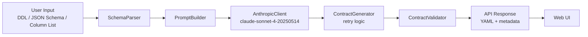

# GenAI Data Contract Generator

Generate production-ready [datacontract.com](https://datacontract.com) 0.9.3 YAML contracts from SQL DDL, JSON Schema, or plain column lists, powered by Claude AI.

## Quickstart (3 commands)

```bash
# 1. Install
pip install -e ".[dev]"

# 2. Set your API key
export ANTHROPIC_API_KEY=sk-ant-...

# 3. Run
uvicorn api.main:app --reload --port 8000
```

Open [http://localhost:8000](http://localhost:8000) for the web UI, or [http://localhost:8000/docs](http://localhost:8000/docs) for the interactive API docs.

---

## Architecture



---

## API Reference

### `POST /api/v1/contracts/generate`

Generate a data contract from any supported input format.

**Request body:**
```json
{
  "input_format": "ddl",
  "content": "CREATE TABLE silver_orders (...);",
  "options": {
    "owner": "orders-team@company.com",
    "domain": "orders",
    "strict_quality": false
  }
}
```

**Response:**
```json
{
  "contract_yaml": "dataContractSpecification: '0.9.3'\n...",
  "validation": { "valid": true, "errors": [], "warnings": [] },
  "metadata": {
    "model": "claude-sonnet-4-20250514",
    "tokens_used": 1340,
    "latency_ms": 1850.4,
    "retry_count": 0
  },
  "parsed_schema": {
    "table_name": "silver_orders",
    "detected_layer": "silver",
    "column_count": 14
  }
}
```

**curl example:**
```bash
curl -X POST http://localhost:8000/api/v1/contracts/generate \
  -H "Content-Type: application/json" \
  -d '{
    "input_format": "ddl",
    "content": "CREATE TABLE silver_orders (order_id VARCHAR(36) NOT NULL, user_id BIGINT NOT NULL, total_amount NUMERIC(12,2));",
    "options": { "owner": "orders@company.com" }
  }'
```

---

### `POST /api/v1/contracts/validate`

Validate an existing YAML data contract against the 0.9.3 spec.

**Request body:**
```json
{ "contract_yaml": "dataContractSpecification: '0.9.3'\n..." }
```

**curl example:**
```bash
curl -X POST http://localhost:8000/api/v1/contracts/validate \
  -H "Content-Type: application/json" \
  -d '{ "contract_yaml": "dataContractSpecification: 0.9.3\ninfo:\n  title: Test\n  version: 1.0.0\n  owner: me@co.com\nmodels: {}\nid: test" }'
```

---

### `GET /api/v1/contracts/examples`

Returns all example inputs from the `/examples/` directory.

```bash
curl http://localhost:8000/api/v1/contracts/examples
```

---

### `GET /health`

```bash
curl http://localhost:8000/health
# {"status":"ok","version":"0.1.0","anthropic_configured":true}
```

---

## JSON Schema example

```bash
curl -X POST http://localhost:8000/api/v1/contracts/generate \
  -H "Content-Type: application/json" \
  -d '{
    "input_format": "json_schema",
    "content": {
      "title": "gold_products",
      "type": "object",
      "required": ["product_id", "name"],
      "properties": {
        "product_id": { "type": "string", "format": "uuid" },
        "name":       { "type": "string" },
        "price":      { "type": "number" }
      }
    }
  }'
```

## Column list example

```bash
curl -X POST http://localhost:8000/api/v1/contracts/generate \
  -H "Content-Type: application/json" \
  -d '{
    "input_format": "column_list",
    "content": {
      "table_name": "silver_orders",
      "columns": [
        { "name": "order_id",     "type": "varchar", "nullable": false },
        { "name": "total_amount", "type": "numeric", "nullable": false },
        { "name": "created_at",   "type": "timestamp", "nullable": false }
      ]
    }
  }'
```

---

## How PII detection works

The `PromptBuilder` applies a keyword heuristic to every column name. If the lowercase column name **contains** any of the following strings, the field is tagged `pii: true` in the generated contract:

| Pattern | Example columns |
|---------|----------------|
| `email` | `customer_email`, `email_address` |
| `phone` | `phone_number`, `mobile_phone` |
| `cpf`   | `user_cpf`, `cpf_number` |
| `ssn`   | `ssn`, `social_ssn` |
| `name`  | `full_name`, `first_name`, `last_name` |
| `address` | `billing_address`, `shipping_address` |
| `birth` | `birth_date`, `date_of_birth` |
| `gender` | `gender`, `gender_identity` |
| `nationality` | `nationality` |

This is intentionally conservative: false positives are preferable to missed PII fields.

---

## How quality rules are inferred

| Condition | Rule generated |
|-----------|---------------|
| Column is `NOT NULL` | `not_null` |
| Column name ends with `_id` or is a primary key | `unique` |
| `amount`, `price`, `revenue`, `cost` + numeric type | `min: 0` |
| `age` + numeric type | `min: 0`, `max: 150` |
| `email` in column name | `regex` (RFC 5322 pattern) |
| `_id` column + `string` type | `regex` (UUID v4 pattern) |
| `date` in column name + `string` type | `regex` (ISO 8601 pattern) |

---

## Adding new quality rules

1. Open `core/prompt_builder.py`
2. Add your logic inside `_build_quality_rules(col: ColumnDef)`:

```python
# Example: flag percentage columns to be between 0 and 100
if "rate" in col.name.lower() or "pct" in col.name.lower():
    if col.data_type in ("decimal", "double", "float"):
        rules.append({"type": "min", "column": col.name, "value": 0})
        rules.append({"type": "max", "column": col.name, "value": 100})
```

3. Add a test in `tests/test_prompt_builder.py` under `TestQualityRules`.

---

## Layer detection

The detected layer controls the `sla.freshness_hours` default:

| Prefix | Layer | Freshness |
|--------|-------|-----------|
| `bronze_`, `raw_`, `stg_landing_` | bronze | 2h |
| `silver_`, `stg_`, `int_` | silver | 4h |
| `gold_`, `mart_`, `dim_`, `fact_`, `agg_` | gold | 8h |
| (no match) | unknown | 24h |

---

## Running tests

```bash
pytest --cov=. --cov-report=term-missing
```

Target: **≥ 85% coverage** (enforced in `pyproject.toml`).

---

## Project structure

```
genai-contract-generator/
├── api/
│   ├── main.py                  # FastAPI app, CORS, rate limiter wiring
│   ├── routes/
│   │   ├── contracts.py         # /generate, /validate, /examples
│   │   └── health.py            # /health
│   └── middleware/
│       └── rate_limiter.py      # Sliding-window 10 req/min per IP
├── core/
│   ├── schema_parser.py         # DDLParser, JSONSchemaParser, ColumnListParser
│   ├── prompt_builder.py        # Builds Claude prompt with PII/quality/SLA
│   ├── contract_generator.py    # Calls Claude, retries, returns GeneratedContract
│   └── contract_validator.py   # Validates YAML structure
├── integrations/
│   ├── anthropic_client.py      # Wraps Anthropic SDK (claude-sonnet-4-20250514)
│   └── datacontract_cli.py      # Optional deep lint via datacontract-cli binary
├── models/
│   ├── input_models.py          # Pydantic request models
│   └── output_models.py         # Pydantic response models
├── ui/index.html                # Self-contained vanilla JS UI
├── tests/                       # pytest suite (≥85% coverage)
├── examples/                    # Sample DDL, JSON Schema, expected YAML
├── pyproject.toml
└── config.yaml
```

---

## Environment variables

| Variable | Required | Description |
|----------|----------|-------------|
| `ANTHROPIC_API_KEY` | Yes | Your Anthropic API key |

The app reads `.env` via `python-dotenv` automatically on startup.

---

## Tech stack

- **Python 3.11+**
- **FastAPI** + **Uvicorn**: ASGI web framework
- **Anthropic Python SDK**: Claude integration
- **sqlglot**: SQL DDL parsing
- **Pydantic v2**: data validation
- **PyYAML**: YAML parsing/serialization
- **structlog**: structured JSON-friendly logging
- **pytest** + **pytest-mock**: test suite
